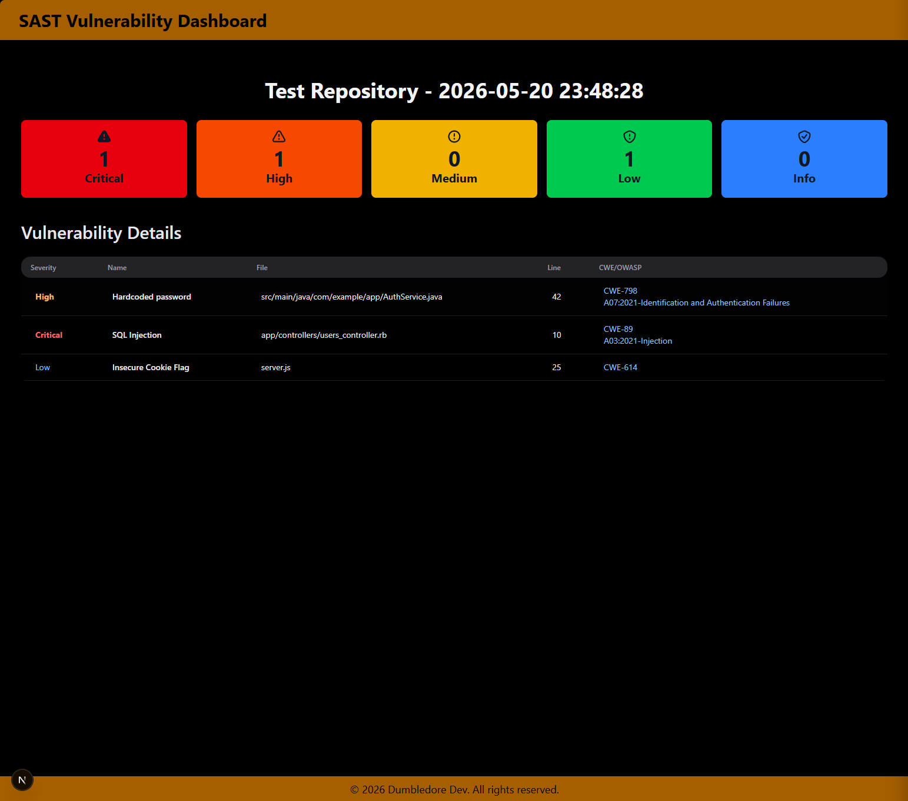
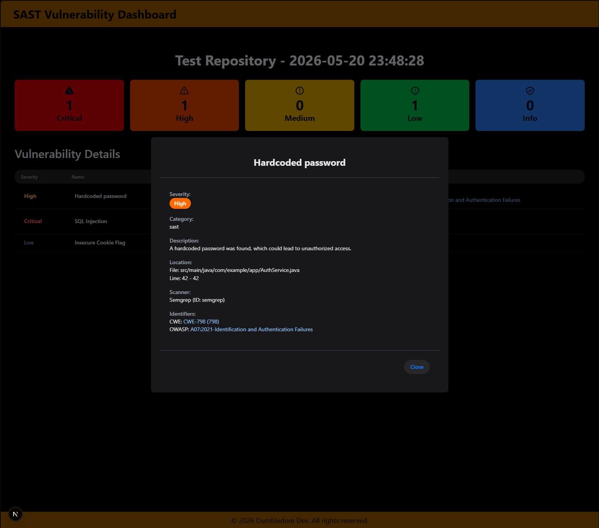

# Vulnerabilities Dashboard

A dashboard for visualizing security-scan reports — SAST, secret detection, dependency scanning, and container scanning — primarily fed by GitLab CI/CD. Started as a SAST-only tool (the package/Docker image are still named `sast-dashboard`); it now covers four report kinds via dedicated webhooks, plus a manual JSON upload for ad-hoc SAST reports.

## Features

*   **Manual Upload:** Upload a SAST report JSON file directly from your browser (scratch viewer only — not persisted).
*   **GitLab Webhook Integration:** Receives SAST/secret-detection, dependency-scan (Trivy filesystem), and container-scan (Trivy image) reports from GitLab CI/CD pipelines.
*   **Unique Report Pages:** Each received report is stored and accessible via a unique URL.
*   **Vulnerability Overview:** Displays severity counters (Critical, High, Medium, Low, Info) for quick insights.
*   **Detailed Vulnerability / Scan Tables:** Comprehensive per-report-type tables (SAST vulnerabilities with severity/name/file/line/CWE/OWASP identifiers; dependency and container findings from Trivy).
*   **Discord Notifications:** Sends a summary of new SAST reports to a configured Discord channel.
*   **Non-relational Database:** Uses LowDB (file-based JSON database, `db.json`) for server-side storage of reports — no external database required.

## Getting Started

### Prerequisites

*   Node.js (v22+; the Docker images use Node 26)
*   pnpm (v11+ recommended; Docker images pin `pnpm@11.1.3` via corepack)
*   A GitLab project with SAST / Secret Detection / dependency / container scanning configured
*   A Discord server and channel for notifications (optional)

### Installation

1.  **Clone the repository:**
    ```bash
    git clone https://github.com/viniroveran/SAST-Dashboard-for-Gitlab.git sast-vulnerability-dashboard
    cd sast-vulnerability-dashboard
    ```
2.  **Install dependencies:**
    ```bash
    pnpm install
    ```
3.  **Create environment variables:**
    Create a `.env.local` file in the root of your project.

### Environment Variables

The application uses environment variables for configuration. Create a `.env.local` file in the root of your project and populate it with the following:

```dotenv
# Base URL of your Next.js application (e.g., http://localhost:3000 or https://your-domain.com)
NEXT_PUBLIC_BASE_URL=http://localhost:3000

# Secret token for authenticating GitLab webhooks. Checked against the
# X-Gitlab-Token header on every /api/*-webhook route.
GITLAB_WEBHOOK_SECRET=your_secure_gitlab_webhook_secret_here

# Discord webhook URL for SAST report notifications.
# If not set, Discord notifications are skipped (SAST endpoint only).
DISCORD_WEBHOOK_URL=https://discord.com/api/webhooks/YOUR_ID/YOUR_TOKEN
```

### Running the Application

1.  **Start the development server:**
    ```bash
    pnpm dev
    ```
    The application will be accessible at `http://localhost:3000` (or the port specified in `NEXT_PUBLIC_BASE_URL`).

2.  **Build for production:**
    ```bash
    pnpm build
    ```
3.  **Start in production mode:**
    ```bash
    pnpm start
    ```
4.  **Lint:**
    ```bash
    pnpm lint
    ```

## Docker

### Local development

`docker compose up` builds from `Dockerfile.dev` and runs `pnpm i && pnpm run dev` with the repo bind-mounted, so edits hot-reload without rebuilding the image. Requires `.env.development` (same variables as above).

### Production image

`Dockerfile` is a multi-stage pnpm build producing a standalone runtime image. It bakes `db.json` under `/app/db` — the container is **stateful**, so a redeploy without a persistent volume mounted at `/app/db` loses stored reports.

```bash
docker build \
  --build-arg NEXT_PUBLIC_BASE_URL=https://your-domain.com \
  -t viniroveran/sast-dashboard:latest \
  .

docker run -p 3000:3000 \
  -e GITLAB_WEBHOOK_SECRET=your_secure_gitlab_webhook_secret_here \
  -e NEXT_PUBLIC_BASE_URL=https://your-domain.com \
  -v sast-dashboard-db:/app/db \
  viniroveran/sast-dashboard:latest
```

### Publishing to Docker Hub

```bash
docker login
docker build -t viniroveran/sast-dashboard:latest .
docker push viniroveran/sast-dashboard:latest
```

## Screenshots

Here are some screenshots of the application in action:

### Dashboard Overview



### Vulnerability Details Modal



## GitLab Webhook Documentation

All webhook routes are `POST`-only and require:

*   `Content-Type: application/json`
*   `X-Gitlab-Token`: must match the `GITLAB_WEBHOOK_SECRET` environment variable — a mismatch (or missing header) returns `401 Unauthorized`.

### `POST /api/sast-webhook` — SAST + Secret Detection

Consolidated SAST and/or secret-detection findings, keyed by repo. `sastReport` is expected to already be the merged `{ vulnerabilities: [...] }` shape — **not** the raw `gl-sast-report.json` file — since one report typically combines both `gl-sast-report.json` and `gl-secret-detection-report.json`.

Request body:

```json
{
  "repoName": "your-repository-name",
  "sastReport": {
    "vulnerabilities": [
      {
        "id": "a1b2c3d4-e5f6-7890-1234-567890abcdef",
        "category": "sast",
        "name": "Hardcoded password",
        "severity": "High",
        "location": {
          "file": "src/main/java/com/example/app/AuthService.java",
          "start_line": 42
        }
      }
    ]
  }
}
```

Responses:

*   `200 OK` — `{ "message": "SAST report received and stored successfully.", "reportId": "...", "viewUrl": "https://your-domain.com/reports/<id>" }`
*   `400 Bad Request` — `{ "message": "Missing repoName or sastReport in payload." }`
*   `500 Internal Server Error` — `{ "message": "Internal Server Error" }`

If `DISCORD_WEBHOOK_URL` is set, a summary embed is also posted to Discord for this endpoint only.

### `POST /api/dependency-webhook` — Dependency Scanning (Trivy filesystem)

`trivyReport` is the raw output of `trivy fs --format json`.

```json
{
  "repoName": "your-repository-name",
  "trivyReport": { "...": "full trivy fs --format json output" }
}
```

Responses: `201 Created` — `{ "success": true, "id": "...", "viewUrl": "https://your-domain.com/dependency-scan/<id>" }`; `422 Unprocessable Entity` if `repoName`/`trivyReport` is missing; `500` on internal error.

### `POST /api/container-scan-webhook` — Container Scanning (Trivy image)

`containerScanReport` is the raw output of `trivy image --format json`.

```json
{
  "repoName": "your-repository-name",
  "containerScanReport": { "...": "full trivy image --format json output" }
}
```

Responses: `200 OK` — `{ "success": true, "id": "..." }` (no `viewUrl`; view at `/container-scan/<id>`); `400 Bad Request` if `repoName`/`containerScanReport` is missing; `500` on internal error.

### Configuring GitLab CI/CD to send reports

The TBI `backend` repo's `.gitlab-ci.yml` (`send_reports` job, stage `reporting`) is the reference implementation: it collects `gl-sast-report.json` + `gl-secret-detection-report.json` into one consolidated `sastReport.vulnerabilities` array, and forwards `trivy-dependency-scanning-report.json` / `trivy-container-scanning-report.json` as-is to the other two endpoints. Both `jq` and `curl` read/send each payload via a file (`jq --slurpfile` in, `curl -d @file` out) rather than a shell variable on argv — a large report on either command's argv blows past the OS's exec argument-size limit (`Argument list too long` / E2BIG); it doesn't matter which of the two commands you fix if the other still takes the payload as a plain argument. Required CI/CD variables:

*   `SAST_DASHBOARD_URL` (or equivalent): base URL of this app, e.g. `https://sast-dashboard.dumbledore.dev`.
*   `GITLAB_WEBHOOK_SECRET`: the shared secret, marked "Protected" and "Masked".

For any other project, mirror that job's `jq`/`curl` calls against the payload shapes documented above, pointed at `$SAST_DASHBOARD_URL/api/sast-webhook`, `/api/dependency-webhook`, and `/api/container-scan-webhook` respectively — the route paths and payload field names must match exactly, since there's no schema validation layer between them.

## Local Testing with Bruno/Postman

To test a webhook locally or manually:

1.  Ensure your Next.js development server is running (`pnpm dev`).
2.  Send a `POST` request to `http://localhost:3000/api/sast-webhook` (or `/api/dependency-webhook`, `/api/container-scan-webhook`).
3.  Set the `Content-Type` header to `application/json`.
4.  If `GITLAB_WEBHOOK_SECRET` is configured, add an `X-Gitlab-Token` header with your secret.
5.  Use the JSON request body structure for that endpoint, as documented above.

Upon successful submission, you'll receive the response documented above for that endpoint; if it includes a `viewUrl`, navigate there to see the report.

---
